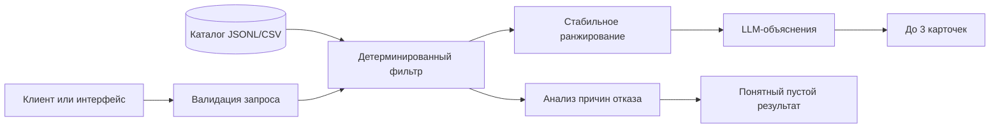

# Умный подбор event-подрядчиков

Сервис подбирает до трёх event-подрядчиков из уже сформированного каталога и объясняет, почему каждый из них подходит под конкретное мероприятие. Решение предназначено для заказчиков мероприятий в Казахстане, которым нужно быстро сократить длинный список исполнителей с учётом города, даты, формата, категории и бюджета.

> [!IMPORTANT]
> В репозитории уже есть backend с фильтрацией, FastAPI и подключённым модулем объяснений. Пользовательского веб-интерфейса пока нет; проверить API можно на странице `/docs`.

## Что реализует решение

- принимает город, дату, тип мероприятия, категорию подрядчика и бюджет;
- дополнительно учитывает язык работы и требуемую длительность присутствия;
- исключает подрядчиков, занятых в выбранную дату;
- проверяет город, категорию, формат, бюджет, язык и длительность;
- возвращает не более трёх карточек в стабильном порядке;
- показывает в карточке имя, категорию, город, цену и конкретное объяснение выбора;
- отличает синтетические профили от исходных;
- явно разделяет три результата: кандидаты подобраны, в городе нет такой категории, кандидаты есть, но не прошли условия;
- объясняет пустую выдачу вместо показа пустого экрана или технической ошибки.

Бронирование, отправка заявок и уведомления подрядчиков не входят в текущий сценарий.

## Как работает решение

1. Клиент отправляет параметры мероприятия в HTTP API.
2. Сервис валидирует запрос и загружает каталог подрядчиков.
3. Детерминированный фильтр исключает неподходящие профили: другой город или категория, занятая дата, превышенный бюджет, неподдерживаемый формат, язык или длительность.
4. Оставшиеся кандидаты ранжируются по фиксированным правилам. LLM не решает, кто допускается в выдачу, поэтому не может вернуть занятого или слишком дорогого подрядчика.
5. Для лучших кандидатов LLM формирует по 1–2 предложения на основе фактов профиля и параметров запроса. Общие формулировки вроде «отличный выбор» не используются.
6. API возвращает до трёх карточек либо понятную причину, почему результатов нет или их меньше трёх.

Одинаковый запрос должен давать один и тот же порядок карточек. Изменение даты может менять выдачу из-за календаря занятости.

## Архитектура



Основные файлы репозитория:

```text
hackathon-contractors/
├── api.py
├── main.py
├── demo.py
├── data/
│   ├── hackathon-dataset-anonymized.csv
│   └── hackathon-dataset-anonymized.jsonl
├── src/
│   ├── __init__.py
│   ├── data_loader.py
│   ├── filter_engine.py
│   ├── llm_contract.py
│   ├── llm_explainer.py
│   ├── models.py
│   └── recommendation_service.py
├── docs/
├── examples/
├── tests/
├── requirements.txt
├── .env.example
└── README.md
```

| Компонент | Ответственность |
|---|---|
| `api.py` | HTTP API для проверки доступности, параметров и рекомендаций |
| `src/filter_engine.py` | фильтрация, причины отказа и стабильное ранжирование |
| `src/recommendation_service.py` | соединяет фильтрацию и объяснения |
| `src/llm_explainer.py` | объяснения по переданным фактам и локальный fallback |
| `data/` | анонимизированный каталог подрядчиков и их календарь занятости |

## Технологии

Используемые технологии:

- Python 3.10+;
- FastAPI и Uvicorn — HTTP API;
- OpenAI SDK — OpenAI API или совместимый NVIDIA endpoint;
- LLM API — генерация коротких объяснений;
- python-dotenv — локальная конфигурация API-ключей;
- JSONL/CSV — формат данных подрядчиков.

Зависимости и версии указаны в `requirements.txt`. Настройки провайдера и модели — в `.env.example`.

## Данные и интеграции

В исходном анонимизированном датасете содержится 66 профилей подрядчиков:

- 17 категорий;
- 50 профилей из Алматы, 15 из Астаны и 1 профиль из категории «Зарубежье»;
- 13 полностью синтетических профилей с признаком `synthetic: true`;
- 8 восстановленных значений города и 18 восстановленных цен;
- цены от 100 000 до 6 000 000 ₸;
- календарь занятости с 23 сентября по 31 декабря 2026 года.

Основные поля: `id`, `anon_name`, `categories`, `city`, `price_from_kzt`, `event_formats`, `languages`, `max_hours`, `busy_dates`, `description`, `synthetic`, `city_imputed`, `price_imputed`.

Персональные данные отсутствуют: имена вымышлены, дополнительная анонимизация не требуется. API-ключ LLM хранится только в локальном `.env` и не должен попадать в Git.

## Установка и запуск

Команды для Windows PowerShell:

```powershell
# Windows PowerShell
py -3.11 -m venv .venv
.\.venv\Scripts\Activate.ps1
python -m pip install --upgrade pip
pip install -r requirements.txt
Copy-Item .env.example .env
```

Для macOS/Linux:

```bash
python3 -m venv .venv
source .venv/bin/activate
python -m pip install -r requirements.txt
cp .env.example .env
```

В `.env` укажите свой `OPENAI_API_KEY`, затем запустите API:

```bash
python -m uvicorn api:app --reload --host 127.0.0.1 --port 8000
```

Откройте `http://127.0.0.1:8000/docs` и отправьте запрос через `POST /recommendations`. Подробная инструкция находится в [BACKEND_README.md](BACKEND_README.md).

## Как проверить решение

Ниже приведены сценарии, которые можно отправить через страницу API `/docs` на исходном датасете.

### 1. Плотная категория

| Параметр | Значение |
|---|---|
| Город | Алматы |
| Дата | 18.10.2026 |
| Тип мероприятия | корпоратив |
| Категория | Ведущий |
| Бюджет | 1 300 000 ₸ |
| Язык и длительность | не указывать |

Ожидается три карточки из нескольких подходящих профилей. Повторный запуск должен сохранить их порядок и объяснения должны ссылаться на разные факты из профилей.

### 2. Редкая категория

| Параметр | Значение |
|---|---|
| Город | Алматы |
| Дата | 15.10.2026 |
| Тип мероприятия | свадьба |
| Категория | Флорист |
| Бюджет | 500 000 ₸ |
| Язык | русский |

В исходном датасете условия проходят два профиля. API должен вернуть обе карточки и объяснить, почему результатов меньше трёх.

### 3. Кандидаты есть, но условия не проходят

| Параметр | Значение |
|---|---|
| Город | Алматы |
| Дата | 26.12.2026 |
| Тип мероприятия | свадьба |
| Категория | Ведущий |
| Бюджет | 100 000 ₸ |
| Язык | русский |
| Длительность | 6 часов |

В Алматы есть ведущие, однако запрос не должен вернуть карточки. Пользователь должен увидеть конкретные причины: бюджет, занятость, формат или сочетание ограничений.

Дополнительно можно проверить отдельный исход «в городе нет такой категории» запросом на декоратора в Астане.

Для проверки влияния календаря повторите первый сценарий с другой датой. Состав выдачи может измениться, но занятый на выбранную дату профиль появляться не должен.

## Ограничения

- каталог содержит только 66 профилей и не является полноценной базой рынка;
- данные ограничены Алматы, Астаной и одним зарубежным профилем;
- календарь покрывает только период 23.09.2026–31.12.2026;
- цена `price_from_kzt` является стартовой и не заменяет итоговый расчёт подрядчика;
- часть городов и цен была восстановлена при подготовке датасета;
- качество объяснений зависит от доступности и поведения внешнего LLM API;
- решение не выполняет бронирование, оплату и коммуникацию с подрядчиком;
- полноценный пользовательский веб-интерфейс пока не добавлен;
- внешняя LLM используется только для объяснений; при отсутствии ключа или сбое остаются локальные сообщения.

## Deployed-версия

Публичная deployed-версия пока не опубликована.
