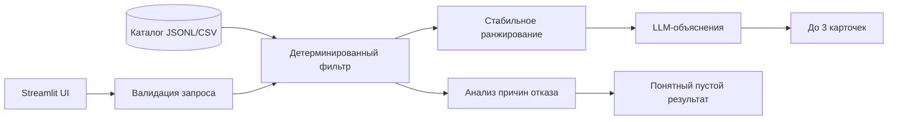

# Умный подбор event-подрядчиков

Сервис подбирает до трёх event-подрядчиков из уже сформированного каталога и объясняет, почему каждый из них подходит под конкретное мероприятие. Решение предназначено для заказчиков мероприятий в Казахстане, которым нужно быстро сократить длинный список исполнителей с учётом города, даты, формата, категории и бюджета.

> [!IMPORTANT]
> README подготовлен по техническому заданию задачи **#79-lite** и переданному датасету. На момент подготовки в рабочей папке ещё нет исходного кода, `requirements.txt` и конфигурации окружения. Поэтому разделы об архитектуре и запуске описывают целевую реализацию и должны быть сверены после добавления кода.

## Что реализует решение

- принимает город, дату, тип мероприятия, категорию подрядчика и бюджет;
- дополнительно учитывает язык работы и требуемую длительность присутствия;
- исключает подрядчиков, занятых в выбранную дату;
- проверяет город, категорию, формат, бюджет, язык и длительность;
- возвращает не более трёх карточек в стабильном порядке;
- показывает в карточке имя, категорию, город, цену и конкретное объяснение выбора;
- отличает синтетические профили от исходных;
- явно разделяет три результата: кандидаты подобраны, в городе нет такой категории, кандидаты есть, но не прошли условия;
- объясняет пустую выдачу вместо показа пустого экрана или технической ошибки.

Бронирование, отправка заявок и уведомления подрядчиков не входят в текущий сценарий.

## Как работает решение

1. Пользователь задаёт параметры мероприятия в интерфейсе.
2. Сервис валидирует запрос и загружает каталог подрядчиков.
3. Детерминированный фильтр исключает неподходящие профили: другой город или категория, занятая дата, превышенный бюджет, неподдерживаемый формат, язык или длительность.
4. Оставшиеся кандидаты ранжируются по фиксированным правилам. LLM не решает, кто допускается в выдачу, поэтому не может вернуть занятого или слишком дорогого подрядчика.
5. Для лучших кандидатов LLM формирует по 1–2 предложения на основе фактов профиля и параметров запроса. Общие формулировки вроде «отличный выбор» не используются.
6. Интерфейс показывает до трёх карточек либо понятную причину, почему результатов нет или их меньше трёх.

Одинаковый запрос должен давать один и тот же порядок карточек. Изменение даты может менять выдачу из-за календаря занятости.

## Архитектура



Предполагаемая структура репозитория:

```text
hackathon-contractors/
├── data/
│   └── hackathon-dataset-anonymized.jsonl
├── src/
│   ├── __init__.py
│   ├── filter_engine.py
│   └── llm_explainer.py
├── app.py
├── requirements.txt
├── .env.example
└── README.md
```

| Компонент | Ответственность |
|---|---|
| `app.py` | ввод параметров, запуск пайплайна и отображение карточек в Streamlit |
| `src/filter_engine.py` | загрузка данных, жёсткая фильтрация, причины отказа и стабильное ранжирование |
| `src/llm_explainer.py` | генерация персональных объяснений только по переданным фактам |
| `data/` | анонимизированный каталог подрядчиков и их календарь занятости |

## Технологии

Целевой стек решения:

- Python 3.11+;
- Streamlit — демонстрационный веб-интерфейс;
- pandas — загрузка и обработка каталога;
- LLM через API — генерация коротких персональных объяснений;
- python-dotenv — локальная конфигурация API-ключей;
- JSONL/CSV — формат данных подрядчиков.

Конкретный LLM-провайдер, модель и версии библиотек необходимо указать после добавления `requirements.txt` и модуля интеграции.

## Данные и интеграции

В исходном анонимизированном датасете содержится 66 профилей подрядчиков:

- 17 категорий;
- 50 профилей из Алматы, 15 из Астаны и 1 профиль из категории «Зарубежье»;
- 13 полностью синтетических профилей с признаком `synthetic: true`;
- 8 восстановленных значений города и 18 восстановленных цен;
- цены от 100 000 до 6 000 000 ₸;
- календарь занятости с 23 сентября по 31 декабря 2026 года.

Основные поля: `id`, `anon_name`, `categories`, `city`, `price_from_kzt`, `event_formats`, `languages`, `max_hours`, `busy_dates`, `description`, `synthetic`, `city_imputed`, `price_imputed`.

Персональные данные отсутствуют: имена вымышлены, дополнительная анонимизация не требуется. API-ключ LLM хранится только в локальном `.env` и не должен попадать в Git.

## Установка и запуск

Инструкция станет исполняемой после добавления перечисленных выше файлов проекта.

```powershell
# Windows PowerShell
py -3.11 -m venv .venv
.\.venv\Scripts\Activate.ps1
python -m pip install --upgrade pip
pip install -r requirements.txt
Copy-Item .env.example .env
```

Для Linux или macOS:

```bash
python3.11 -m venv .venv
source .venv/bin/activate
python -m pip install --upgrade pip
pip install -r requirements.txt
cp .env.example .env
```

Поместите датасет в `data/hackathon-dataset-anonymized.jsonl`, затем заполните переменные LLM-провайдера в `.env` и запустите приложение:

```bash
streamlit run app.py
```

После запуска откройте `http://localhost:8501`.

## Как проверить решение

Ниже приведены сценарии, которые можно повторить в интерфейсе на исходном датасете.

### 1. Плотная категория

| Параметр | Значение |
|---|---|
| Город | Алматы |
| Дата | 18.10.2026 |
| Тип мероприятия | корпоратив |
| Категория | Ведущий |
| Бюджет | 1 300 000 ₸ |
| Язык и длительность | не указывать |

Ожидается три карточки из нескольких подходящих профилей. Повторный запуск должен сохранить их порядок и объяснения должны ссылаться на разные факты из профилей.

### 2. Редкая категория

| Параметр | Значение |
|---|---|
| Город | Алматы |
| Дата | 15.10.2026 |
| Тип мероприятия | свадьба |
| Категория | Флорист |
| Бюджет | 500 000 ₸ |
| Язык | русский |

В исходном датасете условия проходят два профиля. Интерфейс должен показать обе карточки и объяснить, почему результатов меньше трёх.

### 3. Кандидаты есть, но условия не проходят

| Параметр | Значение |
|---|---|
| Город | Алматы |
| Дата | 26.12.2026 |
| Тип мероприятия | свадьба |
| Категория | Ведущий |
| Бюджет | 100 000 ₸ |
| Язык | русский |
| Длительность | 6 часов |

В Алматы есть ведущие, однако запрос не должен вернуть карточки. Пользователь должен увидеть конкретные причины: бюджет, занятость, формат или сочетание ограничений.

Дополнительно можно проверить отдельный исход «в городе нет такой категории» запросом на декоратора в Астане.

Для проверки влияния календаря повторите первый сценарий с другой датой. Состав выдачи может измениться, но занятый на выбранную дату профиль появляться не должен.

## Ограничения

- каталог содержит только 66 профилей и не является полноценной базой рынка;
- данные ограничены Алматы, Астаной и одним зарубежным профилем;
- календарь покрывает только период 23.09.2026–31.12.2026;
- цена `price_from_kzt` является стартовой и не заменяет итоговый расчёт подрядчика;
- часть городов и цен была восстановлена при подготовке датасета;
- качество объяснений зависит от доступности и поведения внешнего LLM API;
- решение не выполняет бронирование, оплату и коммуникацию с подрядчиком;
- до добавления исходников фактическая работоспособность, время ответа и конкретная AI-модель не подтверждены.

## Deployed-версия

Публичная deployed-версия пока не опубликована.
